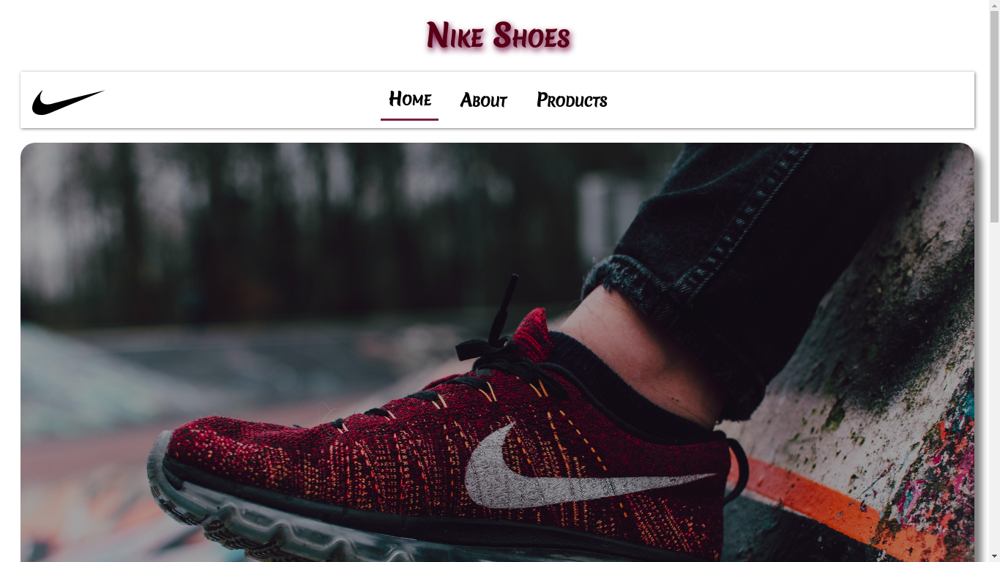
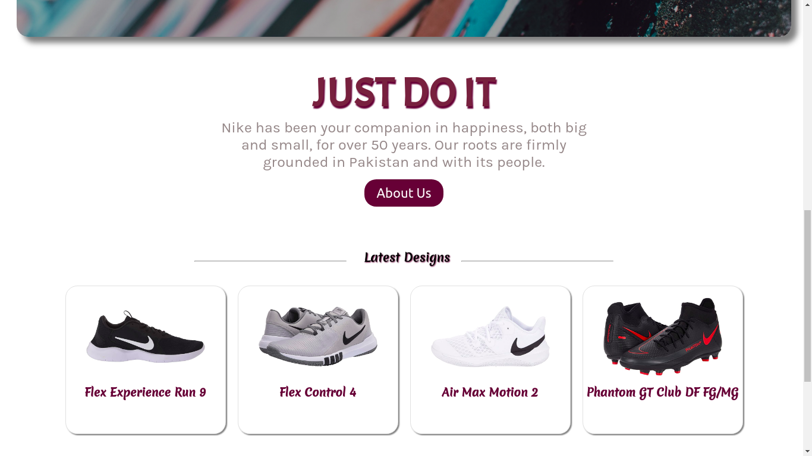
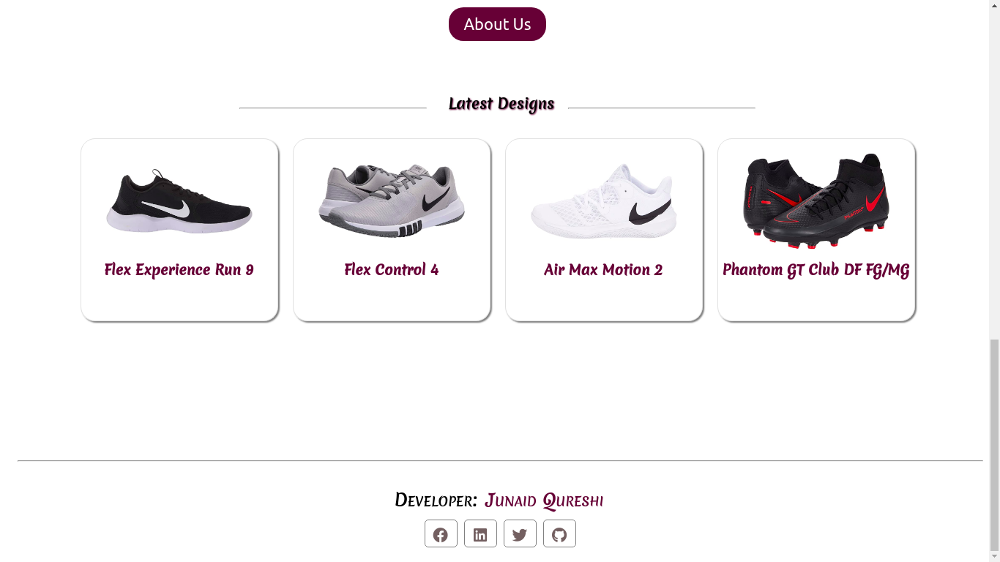

# Nike Shoe Store Website

### *Shoe Showcasing Website for Nike template, I Developed for Practicing purpose.*

# Video
https://www.youtube.com/watch?v=EDyGLYiLBus&feature=youtu.be

# IMAGES

http://nike-shoe-store.surge.sh/

## Run Locally 

- Run this command `git clone https://github.com/developer-junaid/shoeStore.git`
- You are now in the dev environment and you can play around 

## Tech Stack

- HTML5
- CSS3
- Javascript ES6
- React
- React Hooks
- React Router
- VS Code
- Nike Images
- Surge
- Github Actions
